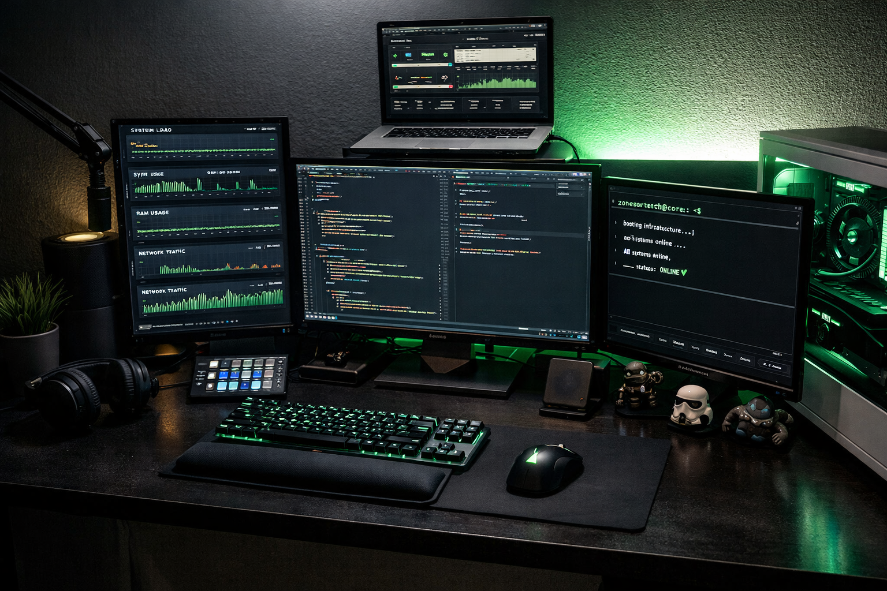

<!-- ================= HEADER ================= -->

<p align="center">
  <svg width="100%" height="160" viewBox="0 0 1000 160" xmlns="http://www.w3.org/2000/svg">
    <rect width="1000" height="160" fill="#0d1117"/>
    <text x="50%" y="45%" dominant-baseline="middle" text-anchor="middle"
      fill="#00ff99" font-family="monospace" font-size="26">
      zonesurtech@core:~$
    </text>
    <text x="50%" y="65%" dominant-baseline="middle" text-anchor="middle"
      fill="#8b949e" font-family="monospace" font-size="14">
      SaaS Architect · AI Systems Engineer · Costa Rica
    </text>
  </svg>
</p>

```bash
booting infrastructure...
loading SaaS modules...
AI engine initialized...
status: ONLINE ✔
```

---

# 👤 PROFILE

<p align="center">
  
</p>

```bash
whoami
→ José Santiago Delgado Leiva

role
→ Full Stack Developer / SaaS Architect

focus
→ Multi-tenant SaaS · AI Automation · Backend Systems

company
→ Zona Sur Tech
```

---

# 🏗 ZONA SUR TECH ECOSYSTEM

<p align="center">
  
</p>

Production-grade SaaS infrastructure focused on:

- Business process automation  
- AI-powered workflows  
- CRM & WhatsApp integrations  
- Electronic billing systems (Costa Rica)  
- Secure API-first architecture  

🌐 https://zonasurtech.online  

---

# 📊 ENGINEERING STACK

Frontend  


Backend  


Infrastructure  


Architecture  


---

# 📈 GITHUB METRICS

<p align="center">
  
</p>

<p align="center">
  
</p>

<p align="center">
  
</p>

---

# 🌐 NETWORK

<p align="center">
  <a href="https://zonasurtech.online">Website</a> •
  <a href="https://www.linkedin.com/in/santi-delgados">LinkedIn</a> •
  <a href="https://www.instagram.com/santidelgados_">Instagram</a>
</p>

---

<p align="center">
  <strong>Zona Sur Tech — Digital Infrastructure That Scales.</strong>
</p>
